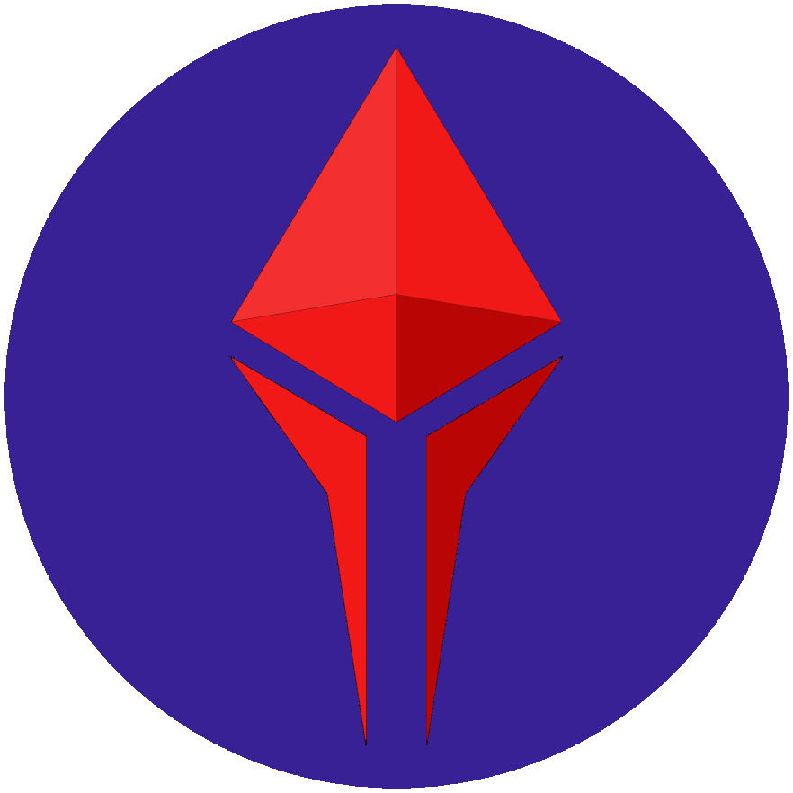

<p align="center"> 
  
</p>

🔥 The [Liquidity Burner Wallet](https://rinkeby.tomfren.ch) is a quick web wallet used to move small amounts of crypto quickly. On page load an Ethereum keypair is automatically generated and used to sign transactions with an incredibly simple interface. Sending funds is as easy as a QR code scan.

🌊 Liquidity Burner Wallet is similar to the Burner Wallet but rather than using the relatively centralised xDai sidechain, it instead allows free near-instant transactions on the [Liquidity Network](https://liquidity.network/) NOCUST commit chain. This means that your funds are secured by the main Ethereum network in a non-custodial fashion. The very small number of validators of the xDai chain (currently only 11!) can lock your funds indefinitely if they wanted to. __As it is non-custorial, no matter what happens to Liquidity Network you can always withdraw your money back to the Ethereum mainnet!__

💵 Burners are analogous to cash: quick and easy but less secure. You wouldn't stuff thousands of dollars in your pocket on the way out the door at night, don't trust a seed phrase in localstorage with more than you are willing to lose.

🎫 Using [paper wallets](https://github.com/austintgriffith/paper-wallet), [ether.cards](https://ether.cards/), or solidcoins, users can be instantly onboarded into a wallet and have tokens or localcoins to purchase goods or services.

🏠 Don't forget to sweep funds to colder storage when you get home at night and burn your ephemeral keys!

<!---
💸 Press the `[Request]` button to instantly create a popup point-of-sale system and have a QR code to display in the window of your shop. Patrons can send you funds with [a simple scan in seconds](https://youtu.be/neZeaXAnkAg).
-->

🌉 Press the `[Bridge]` button to move ETH or DAI that you have sent to your burner onto the [NOCUST Hub](https://liquidity.network/).

🏦 Press the `[Exchange]` button to buy fDAI with fETH using the [TEX](https://tex.liquidity.network/).

🗝️ If you would like more permanence, press the `[Advanced]` button and [use a short pass phrase](https://youtu.be/3zAFo-8p_tg?t=48) to seed a keypair. 

✅ All projects should have a 'burner' version of their product. Take simple fundamentals from your app and put them in an easy to access web version before the barriers to entry. Use this to educate your users about your product and incentivize them to take the next step and download your app. 

🙏 Thanks to Austin Griffith, the original creator of the [Burner Wallet](https://github.com/austintgriffith/burner-wallet) which this is based on.

🛠️ If you are interested in contributing development to the Liquidity Burner Wallet, read on...

## Where can I use the Liquidity Burner Wallet?

A number of versions of the Liquidity Burner Wallet are hosted at the links below:

* Mainnet: [burner.tomfren.ch](https://burner.tomfren.ch)
* Rinkeby testnet: [rinkeby.tomfren.ch](https://rinkeby.tomfren.ch)
* Limbo testnet: [limbo.tomfren.ch](https://limbo.tomfren.ch)

The [Limbo testnet](https://liquidity-network.gitbook.io/project/#private-test-network) runs a NOCUST hub which runs with a shorter checkpoint round time (6 minutes instead of 36 hours). This allows easier testing of withdrawals as two checkpoints need to pass before funds become available on the blockchain.

## Installation

A burner wallet is automatically generated upon visiting [burner.tomfren.ch](https://burner.tomfren.ch) and your private key is stored in a cookie so it will be there when you come back. However, if you want to host your own copy of the Liquidity Burner Wallet then a docker image can be downloaded using the command

```bash
docker pull tomfrench/liquidityburner:latest
```

An example docker compose file is shown below:

```yaml
version: "3.2"
services:
  burner:
    image: tomfrench/liquidityburner:latest
    environment:
      MAINNET_WEB3_PROVIDER: 'https://mainnet.infura.io/v3/[[APIKEY]]' // Required for ENS resolution
      WEB3_PROVIDER: 'https://mainnet.infura.io/v3/[[APIKEY]]'
      HUB_CONTRACT_ADDRESS: '0x83aFD697144408C344ce2271Ce16F33A74b3d98b'
      HUB_API_URL: 'https://public.liquidity.network/'
      TOKEN: "DAI"
    ports:
      - "80:80"
```

There are a number of hubs [deployed on various networks](https://liquidity-network.gitbook.io/project/#currently-deployed-nocust-commit-chains) so `WEB3_PROVIDER`, `HUB_CONTRACT_ADDRESS` and `HUB_API_URL` must be set appropriately to interact with the desired hub.

The `TOKEN` environment variable determines which token other than ETH is used within the wallet. This token must be registered by the hub operator for it to be available.

## Contributing

Assuming you have [nodejs](https://nodejs.org/en/download/) and [git](https://git-scm.com/downloads) already installed...

clone the burner wallet repo
```
git clone https://github.com/TomAFrench/liquidity-burner.git
cd liquidity-burner
```

install burner:
```
npm i
```

start the app :
```
npm start
```
